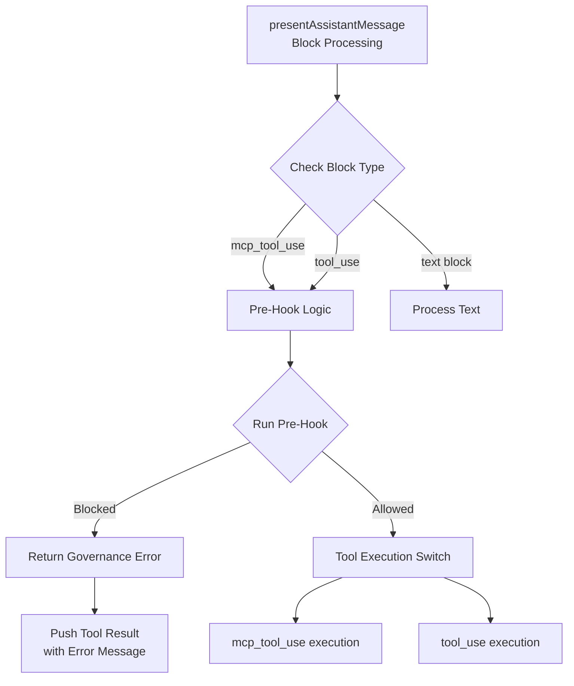

# INT-001: Pre-Hook Logic Implementation Plan

## Task Overview

Implement Pre-Hook logic before the tool execution switch in `presentAssistantMessage.ts` to enable intent governance and tool tracing.

## Constraints

- Logic must be placed before the tool execution switch
- Handshake failure must return a string-based Governance Error
- Scope limited to: `src/core/assistant-messages/presentAssistantMessage.ts` and `src/hooks/`
- Forbidden from modifying: `webview-ui/`

## Architecture Diagram



## Current Architecture Analysis

### Existing Components

1. **preToolUseHook** (`src/hooks/preToolUse.ts`)

    - ✅ Validates intent handshake (lines 28-30)
    - ✅ Reads intent classification from ledger (lines 32-50)
    - ✅ Creates trace entries (lines 52-64)
    - ✅ Returns proper governance error when intentId missing

2. **preToolUseHookAdapter** (`src/core/assistant-message/preToolUseHookAdapter.ts`)

    - ✅ Identifies destructive tools requiring pre-hook validation
    - ✅ Extracts relevant content for logging
    - ✅ Not currently integrated

3. **presentAssistantMessage** (`src/core/assistant-message/presentAssistantMessage.ts`)
    - Main function processing assistant message content
    - Tool execution switch at line 106: `switch (block.type)`
    - Handles both `mcp_tool_use` (lines 107-280) and `tool_use` (lines 300-920) cases

## Integration Design

### Placement Strategy

Place the pre-hook logic **immediately before** the main switch statement (line 106) to satisfy the constraint "Logic must be placed before the tool execution switch."

### Implementation Approach

```typescript
// BEFORE the main switch statement (line 106)
if (block.type === "mcp_tool_use" || block.type === "tool_use") {
	const hookResult = await runPreToolUseHook(cline, block)
	if (hookResult.blocked) {
		// Handle governance violation or pre-hook failure
		return
	}
}
```

### Key Integration Points

1. **MCP Tool Use Case** (lines 107-280)

    - Call pre-hook before MCP tool execution
    - Handle governance violations gracefully

2. **Tool Use Case** (lines 300-920)
    - Call pre-hook before native tool execution
    - Integrate with existing validation flow

## Implementation Steps

### Phase 1: Setup

- [ ] Import `preToolUseHookAdapter` in `presentAssistantMessage.ts`
- [ ] Add pre-hook check before main switch statement

### Phase 2: Case Integration

- [ ] Add pre-hook logic for `mcp_tool_use` case
- [ ] Add pre-hook logic for `tool_use` case
- [ ] Handle pre-hook blocking scenarios

### Phase 3: Error Handling

- [ ] Implement governance violation error handling
- [ ] Ensure string-based Governance Error compliance
- [ ] Add proper tool result reporting for blocked tools

### Phase 4: Testing

- [ ] Test with handshake present (INT-001 active)
- [ ] Test with missing handshake
- [ ] Test destructive vs non-destructive tools
- [ ] Verify trace file creation

## Technical Details

### Pre-Hook Position

The pre-hook logic must execute **after**:

- Locks are established (line 73)
- Current stream index is validated (line 76)
- Block is cloned (line 95)

But **before**:

- Main switch statement (line 106)
- Any tool execution logic

### Error Handling Pattern

When pre-hook blocks execution:

```typescript
if (hookResult.blocked) {
	cline.pushToolResultToUserContent({
		type: "tool_result",
		tool_use_id: sanitizeToolUseId(toolCallId),
		content: hookResult.error,
		is_error: true,
	})
	// Continue processing logic...
	break
}
```

## Constraints Verification

### Governance Error Compliance

✅ The existing `preToolUseHook` already returns:

```typescript
"Governance Error: You have not established a handshake. You must call select_active_intent(intent_id) to verify your architectural scope before you can modify this codebase."
```

### Position Compliance

✅ Placing the pre-hook logic **before line 106** satisfies the constraint "before the tool execution switch"

## Deliverables

1. **Modified Files:**

    - `src/core/assistant-message/presentAssistantMessage.ts`

2. **Verification:**
    - Pre-hook executes before tool execution switch
    - Governance errors returned as string
    - Trace logging functional
    - No breaking changes to existing functionality

## Dependencies

- Existing `preToolUseHook` function
- Existing `preToolUseHookAdapter` function
- Task instance (`cline`) has `activeIntentId` property
- Orchestration ledger file structure

## Risk Assessment

- **Low Risk:** Leverages existing, tested components
- **Medium Impact:** Adds governance layer to tool execution
- **Test Coverage:** Comprehensive testing required for error scenarios
